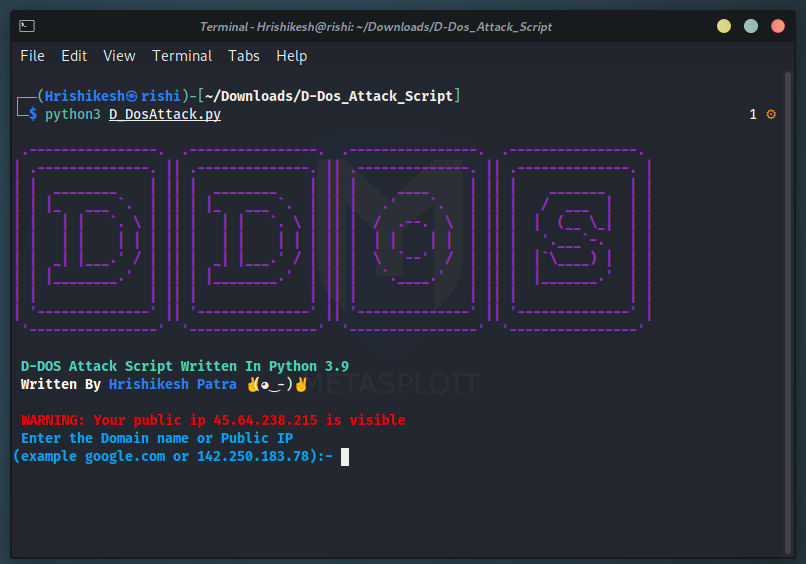

# D-Dos Attack Script
A CLI Based Python3 Script For D-Dos Attack On Public IP Or Domain

**Made In Python(3.9.5)**

## Usage

1. Initiate a Distributed Denial of Service(D-Dos) Attack.
2. Work On Public Domain Or IP Address.

## Features

1. Easy To Use.
2. Colouring Font (won't work in CMD).
3. You Can Adjust Thread Number.
4. Work On Linux & Windows.
5. You Can Change Port Number. (Optional)

## Requirements

- colorama
- requests
- tabulate
- animation
- art

## Installation

- Clone Repository

git clone https://github.com/Hrishikesh7665/D-Dos_Attack_Script.git

- Or

- Download Repository

`Direct Download Zip` [Click Here](https://github.com/Hrishikesh7665/D-Dos_Attack_Script/archive/refs/heads/main.zip)

**For Linux**

- Install Required Modules

1. pip3 install requests
2. pip3 install colorama
3. pip3 install tabulate
4. pip3 install animation
5. pip3 install art

- Or

pip3 install -r requirements.txt

**Single Line Command**

git clone https://github.com/Hrishikesh7665/D-Dos_Attack_Script.git && cd D-Dos_Attack_Script && pip3 install -r requirements.txt

- Run

python3 "D_DosAttack.py"

**For Windows**

- Install Required Modules

1. pip install requests
2. pip install colorama
3. pip install tabulate
4. pip install animation
5. pip install art

- Or

pip install -r requirements.txt

- Run

python "D_DosAttack.py"

**N.B: If You Using Windows Please Use PowerShell Instead Of Command Prompt(CMD) For Best Experience.**

## ScreenShots

1)

2)

3)

## Conclusion & Warnings

- `Warning` Your Anti-Virus Software Maybe Detect This Script As Virus. If You Concern About This, Please Check Virus Total Report Before Using This Script. [Click Here](https://www.virustotal.com/gui/file/4426839e04c4902779d09edfbcb26529d975d5ebf59cc093925a129e941dd303/detection) To Check Virus Total Result.

- `Warning` Your Public Ip Is Visible To The Internet Use A Proxy or Tor Service To Run The Script.

- `Warning` It Is End User's Responsibility To Obey All The Applicable Laws.

**Peace ✌️**
